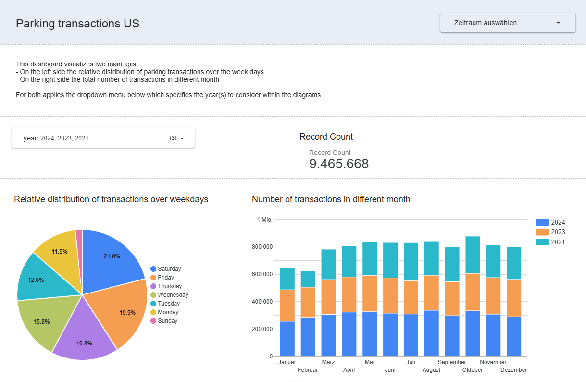

# Parking transactions analysis

## TLDR;

This project analyzes US parking transaction data to identify patterns in weekday and monthly transaction distributions, providing insights to optimize parking policies and infrastructure.

**Tools used within this project**  
🐍 Python for defining pipeline scripts  
🏗️ Terraform for managing infrastructure as code  
🔥 Apache Spark for data batch processing and transformation  
☁️ Google Cloud Storage as Data Lake for storing .parquet files  
🏗️ Google Cloud BigQuery as Data Warehouse  
📊 Google Looker Studio for visualization

**Dataset**  
[Parking Transaction](https://www.kaggle.com/datasets/aniket0712/parking-transactions) dataset including over 15 million records.

**Output**

> [!NOTE]
> The dashboard can be found [here](https://lookerstudio.google.com/reporting/f80ea899-3c74-466c-8167-719864046e90).



## Problem Description

The goal of this data engineering project is to analyze parking transaction data across the United States in order to identify patterns and trends related to parking behaviors. The dataset consists of transaction records, including timestamps and other relevant metadata, such as location and transaction amount whereby the location and transactin amount have not been considered until now (but can be added in another iteration). The project focuses on providing insights into the temporal distribution of parking transactions, specifically across weekdays and months of the year.

**Two key visualizations will be generated to support this analysis:**

- Weekday Distribution of Transactions: This plot will display the relative distribution of parking transactions across different weekdays, helping to understand which days of the week experience the highest and lowest parking activity. This could reveal insights into peak parking demand on specific weekdays and assist cities or businesses in optimizing parking policies, pricing models, or enforcement strategies.

- Monthly Transaction Distribution: This plot will visualize the number of parking transactions by month throughout the year, offering insights into seasonal trends and fluctuations in parking demand. This analysis will help in understanding whether parking transactions tend to increase during certain months (e.g., summer or holiday periods) and can assist in predicting future demand patterns.

By analyzing these two visualizations, the project aims to uncover temporal trends in parking behavior across different regions, ultimately providing actionable insights that can inform urban planning, parking infrastructure development, and policy decisions to better serve users and optimize parking resources.

## Architecture


### Dataset

| Rows                | Type     | Nullable | Example                |
| ------------------- | -------- | -------- | ---------------------- |
| Transaction ID      | int      | False    | 91886070               |
| Source              | text     | False    | Parking Meters         |
| Duration in Minutes | float    | False    | 219.9                  |
| Start Time          | datetime | False    | 03/16/2023 08:19:05 PM |
| End Time            | datetime | False    | 04/16/2023 18:08:33 PM |
| Amount              | float    | False    | 9.16                   |
| App Zone ID         | int      | True     | 39744                  |
| App Zone Group      | text     | True     | East Austin PTMD       |
| Payment Method      | text     | False    | CARD                   |
| Location Group      | text     | True     | East Austin            |
| Last Updated        | datetime | False    | 04/16/2023 18:08:33 PM |

### Data transformation and ingestion

There is an end-to-end pipeline ([end_to_end.py](/pipelines/end_to_end.py)) which can be splitted into two major pieces.

The first pipeline is responsible for:

- Downloading the data from kaggle as _.csv_ file to a temporary directory
- Reading the _.csv_ file with spark, applying transformation and saving the dataframe as _.parquet_ files using repartition in a temporary directory
- Uploading the _.parquet_ files to Google Cloud Storage

> [!NOTE]  
> See the python script **[fetch_and_upload_to_gcs.py](/pipelines/fetch_and_upload_to_gcs.py)**.

The second pipeline is responsible for:

- Inserting the data from Google Cloud Storage to Google Big Query table called _parking_

> [!NOTE]  
> See the python script **[move_to_gbq.py](/pipelines/move_to_gbq.py)**.

Following transformations have been implemented inside the first pipeline using pyspark:

#### Apply schema

```python
SCHEMA = types.StructType(
    [
        types.StructField("ID", types.IntegerType(), True),
        types.StructField("Source", types.StringType(), True),
        types.StructField("Duration in Minutes", types.FloatType(), True),
        types.StructField("Start Time", types.StringType(), True),
        types.StructField("End Time", types.StringType(), True),
        types.StructField("Amount", types.FloatType(), True),
        types.StructField("Kiosk ID", types.IntegerType(), True),
        types.StructField("App Zone ID", types.IntegerType(), True),
        types.StructField("App Zone Group", types.StringType(), True),
        types.StructField("Payment Method", types.StringType(), True),
        types.StructField("Location Group", types.StringType(), True),
        types.StructField("Last Updated", types.StringType(), True),
    ]
)
```

#### Renaming columns

```python
def _rename_columns(df: DataFrame) -> DataFrame:
    print("Rename columns...")
    return (
        df.withColumnRenamed("ID", "id")
        .withColumnRenamed("Source", "source")
        .withColumnRenamed("Duration in Minutes", "duration_in_min")
        .withColumnRenamed("Amount", "amount")
        .withColumnRenamed("Kiosk ID", "kiosk_id")
        .withColumnRenamed("App Zone ID", "app_zone_id")
        .withColumnRenamed("App Zone Group", "app_zone_group")
        .withColumnRenamed("Payment Method", "payment_method")
        .withColumnRenamed("Location Group", "location")
    )
```

#### Fomarting datetimes

```python
def _format_datatime(df: DataFrame) -> DataFrame:
    print("Format datetime...")
    return (
        df.withColumn(
            "start_datetime", to_timestamp("Start Time", "MM/dd/yyyy hh:mm:ss a")
        )
        .withColumn("end_datetime", to_timestamp("End Time", "MM/dd/yyyy hh:mm:ss a"))
        .withColumn(
            "modification_datetime",
            to_timestamp("Last Updated", "MM/dd/yyyy hh:mm:ss a"),
        )
    )
```

#### Add columns

```python
def _add_columns(df: DataFrame) -> DataFrame:
    return (
        df.withColumn("year", year(col("start_datetime")))
        .withColumn("month", month(col("start_datetime")))
        .withColumn("day_of_week", dayofweek(col("start_datetime")))
        .withColumn(
            "amount_per_hour", round((col("amount") / col("duration_in_min")) * 60, 2)
        )
    )
```

### Data warehouse

Based on the _parking_ table (which has been the output of the second pipeline) two further tables are created using partition in order to optimize the queries for downstream tasks.

For the left tile in the dashboard which shows the relative distribution of the parking transactions over the weekdays a partition by the _day_of_week_ column was implemented because the tile uses just the information about the days of the week.

```sql
-- Partition by weekday
-- Adapt the names of your project id, dataset and table accordingly
CREATE OR REPLACE TABLE `traffic-fatalities-455213.parking_transactions.parking_partition_by_weekday`
PARTITION BY
  RANGE_BUCKET(day_of_week, GENERATE_ARRAY(1, 7, 1))
AS
SELECT
    *,
    CASE
      WHEN EXTRACT(DAYOFWEEK FROM start_datetime) = 1 THEN 'Sunday'
      WHEN EXTRACT(DAYOFWEEK FROM start_datetime) = 2 THEN 'Monday'
      WHEN EXTRACT(DAYOFWEEK FROM start_datetime) = 3 THEN 'Tuesday'
      WHEN EXTRACT(DAYOFWEEK FROM start_datetime) = 4 THEN 'Wednesday'
      WHEN EXTRACT(DAYOFWEEK FROM start_datetime) = 5 THEN 'Thursday'
      WHEN EXTRACT(DAYOFWEEK FROM start_datetime) = 6 THEN 'Friday'
      WHEN EXTRACT(DAYOFWEEK FROM start_datetime) = 7 THEN 'Saturday'
    END AS day_of_week_str,
FROM
    `traffic-fatalities-455213.parking_transactions.parking`;
```

For the tiles on the right side which shows the amount of transactions over the different month a partition by the _month_ column was considered reasonable because the data is sorted by month.

```sql
-- Partition by month
-- Adapt the names of your project id, dataset and table accordingly
CREATE OR REPLACE TABLE `traffic-fatalities-455213.parking_transactions.parking_partition_by_month`
PARTITION BY
  RANGE_BUCKET(month, GENERATE_ARRAY(1, 12, 1))
AS
SELECT *  FROM `traffic-fatalities-455213.parking_transactions.parking`;
```

### Dashboard

**Output**

> [!NOTE]
> The dashboard can be found [here](https://lookerstudio.google.com/reporting/f80ea899-3c74-466c-8167-719864046e90).

### Reproducibility

#### Prerequisites

**Tools**

- Python 3.12
- Spark 3.3.2
- Terraform 1.11.3

**Python packages**

- Install the packages listed inside [_requirements.txt_](requirements.txt) file in your environment.

**Environment variables**  
Create an _.env_ file in your root directory based on the _.env.example_ file and export the enviroment variables to your current terminal using `source .env`.

**Google Cloud Platform**  
Create a service account with admin permissions for Google Cloud Storage, Google BigQuery and Compute Engine

> [!Note]  
> Use `gcloud auth activate-service-account --key-file $GOOGLE_APPLICATION_CREDENTIALS` for authorizing with Google Cloud Platform with your service account in order to be able to create, access and upload Google Cloud Storage and Google BigQuery.

#### Setup Infrastructure

```bash
cd terraform/

# create bucket and dataset
terraform apply
```

#### Execute pipeline

In order to orchestrate the whole workflow from downloading _.csv_ file until uploading structured data to Google BigQuery run `python pipelines/end_to_end.py` from your root directory.

#### Create the partitioned tables inside big query

For creating the partitioned tables go to Google Cloud BigQuery and execute the sql commands listed in the [data-warehouse](#data-warehouse) section.

## Challenges

- Setup of infrastructure like GCP, VM, installation of spark
- Transforming datetime from US 12 hours format into unix-style datetime
- Optimazation of table partition for downstream tasks
